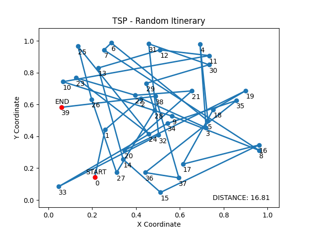

# Traveling SalesmanProblem

The goal of the project is to minimize the distance a traveling salesman must travel between forty cities.

## Table of contents
* [General](#general)
* [Nearest Neighbor and Perturb Search](#nearest-neighbor-and-perturb-search)
* [Simulated Annealing Method](#simulated-annealing-method)

## General
The coordinates of 40 cities were randomly selected and a map was generated. 
Random selection of the path of travel is not effective, and the force method is not possible due to 40! (8.16*10^47) possibile itineraries.
The problem was solved using the following methods:   
- nearest neighbor and perturb search
- different versions of simulated annealing perturb search

## Nearest Neighbor and Perturb Search
The nearest neighbor method is based on finding the nearest city and going to it, and so on every time.

The distance has been significantly reduced, but some improvements may be added to reduce the distance even further.
For this purpose, the perturbd can be used. It is based on randomly selecting two cities, swapping their order in the itinerary 
and checking whether the distance has decreased.If so - you get a new, better itinerary.

## Simulated Annealing Method
The second method is based on the use of the perturbation search method and the temperature function, 
which will allow to choose a worse route at the beginning of searching. The purpose of using the temperature 
function is to find the global maximum, allowing the local maximum to be ignored at the beginning of the search

The method has been improved with a random selection of different perturbing methods 
(such as reversing a subset of cities, moving a subset of cities or just switching the places of two cities)
and a condition to avoid major setbacks.

The last modification was to track the best itineraries and allow the algorithm to return to that best itinerary when a shorter
distance was not found after a long time.

